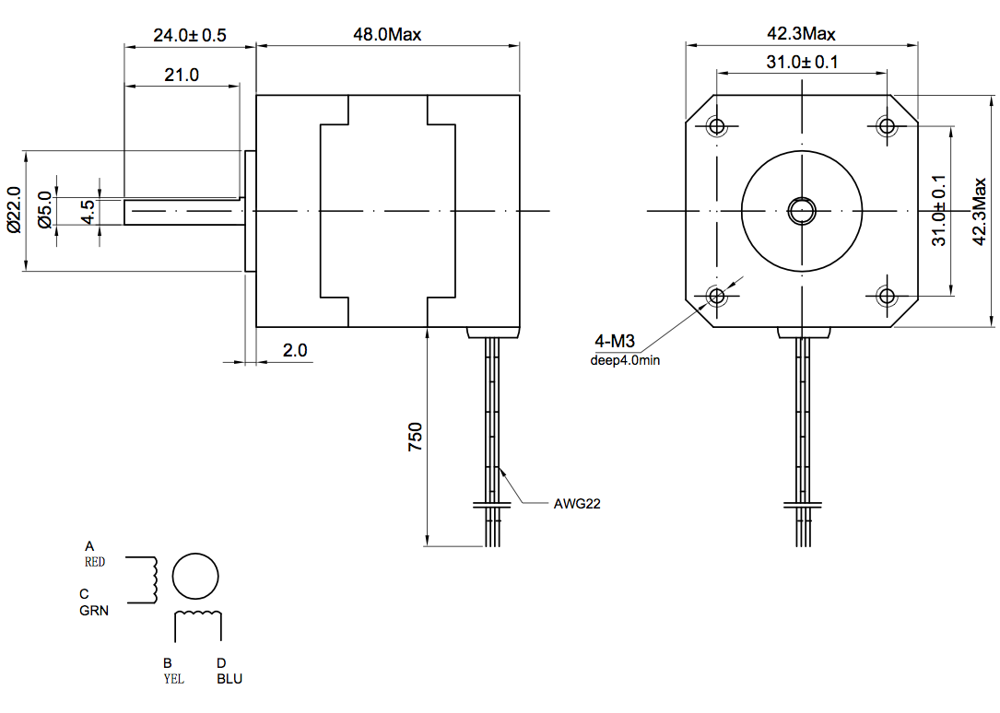
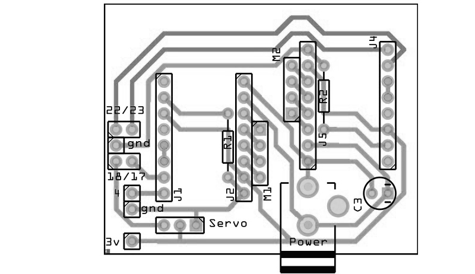
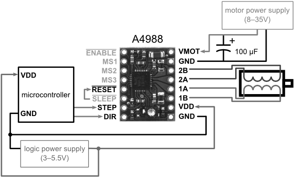
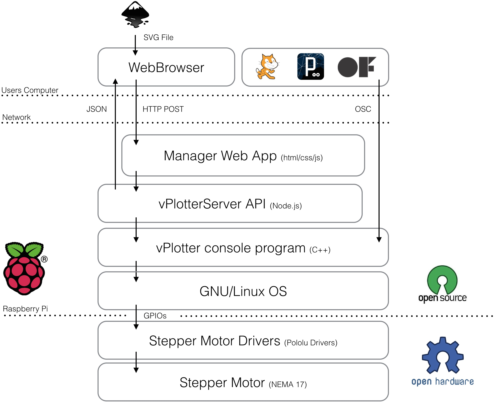

### vPlotter

#### 1.Basic principes 

The vPlotter is essentially a vertical drawing machine that consists of a marker suspended between two motors which moves it over a wall surface.

The math involved in the movement of the marker over the surface is extremely simple. It requires knowing the distance between the motors to calculate how much string distance each motor has to give to the marker (plotter head). This distance can be calculated using Pythagoras' theorem.

Both motors are attached to the wall at the same height to the floor separated by a given distance. The more distance there is between them, the larger the drawing area. I usually separate the motors by 1.5 meters (1500 mm). 

	distance_between_motors = 1500;

So the motors' positions can be represented as: 

	M1.x = 0;
	M1.y = 0;

	M2.x = M1.x + distance_between_motors;		// 1500
	M2.y = 0;

Knowing this we can calculate the position of the plotter head using Pythagoras' theorem. Imagine the triangles composed by the two motors and the plotter head as two right triangles. For each motor we need to find the distance (square root) to the marker. By releasing this amount of string to the plotter head, gravity will make the rest, by tensing the string.

	distance.M1 = square_root( M1.x*M1.x + M1.y*M1.y );
	distance.M2 = square_root( M2.x*M2.x + M2.y*M2.y );

To have precise control on the motors' movements, I'm using two [NEMA 17 steppers motors](https://ultimachine.com/content/kysan-1124090-nema-17-stepper-motor) controlled with a [Pololu A4988 Stepper Driver](https://ultimachine.com/content/pololu-a4988-stepper-driver-heatsink-kit) for each one. 

 

Nema 17 motors have 200 steps for rotation but by enabling quarters of steps on the Pololu drivers we can obtain up to 800 steps for rotation which allows for much more precision. Next we need to calculate the circumference of the pulleys to determine how many millimeters we have for each step. In my case I'm using two [Timing Pulley GT2 of 20 tooth](https://ultimachine.com/content/timing-pulley-gt2-20-tooth) which have a bore of 5mm and match the [GT2 Timing Belt](https://ultimachine.com/content/timing-belt-gt2-custom-length) that holds the plotter header. From that we can calculate the amount of steps using these formulas:

	STEPS = 800;
	DIAMETER = 5; // 5mm
	CIRCUMFERENCE = DIAMETER * PI; // 15.7 mm
	m2s = CIRCUMFERENCE / STEPS; // 0.019625 mm for step

Keeping track of how much string each motor has moved we can estimate with a precision of 0.019625mm the position of the plotter head. I'm keeping track of the number of steps in a structured variable called MotorVal :

	struct MotorVal{
  	  long M1;
    	long M2;
	};

 To calculate the plotter drawing head we can use absolute parameters or relative. This means the an absolute position or a position relative to the previous one. In order to have accurate absolute positions is necessary to know the starting position of the plotting head. For that I use a physical mark on the center of the drawing area to manually adjust the plotter header at the beginning of each drawing work. Other drawing machines like laser cutters or CNC machines have sensors to estimate the initial position.

Another important feature of this drawing machine is the ability to start and stop drawing by moving the marker closer to or further from the wall surface. This is done using a [Micro Servo Motor](http://www.adafruit.com/products/169) mounted on the plotter head. Servos use frequency of pulse to calculate the angle of the motor. They can go from -90 to 90 deg (0 - 180 deg), alternating between 544 to 2400 pulses per second. By moving the marker towards or away from the surface, we can control when it is drawing lines and when it is just moving. This, together with the absolute or relative coordinates, defines 4 types of commands:

	enum Command{
  	  MOVE_ABS = 0,
    	MOVE_REL,
    	LINE_ABS,
    	LINE_REL
	};

Using these commands each line of a drawing is translated to instructions to the motors. 

	void vPlotter::print(vector<ofPolyline> _paths){
		for(int i = 0; i < _paths.size(); i++) {
			for(int j = 0; j < _paths[i].getVertices().size(); j++){
				addInstruction( ((j==0)?MOVE_ABS:LINE_ABS), _paths[i].getVertices()[j] );
			}
		}
		addInstruction(MOVE_ABS, printingArea.getCenter());
	}

	bool vPlotter::addInstruction(Command _command, ofPoint _pos){
		ofPoint t;

		//  ABSolute or RELative positions??
		//
		switch (_command) {
			case MOVE_ABS:
			case LINE_ABS:
				t = _pos;
				break;
			case MOVE_REL:
			case LINE_REL:
				t = _pos + currentPos;
				break;
		}

		//  Make instruction
		//
		Instruction inst;
		inst.set(_pos);
		inst.cmd = _command;
		inst.target = getStepsFor(_pos);

		//  Add
		//
		instructions.push_back(inst);
	}

	MotorVal vPlotter::getStepsFor(ofPoint _pos) {
		MotorVal val;
		val.M1 = M1.distance(_pos)/m2s;
		val.M2 = M2.distance(_pos)/m2s;
		return val;
	}

To ensure consistency, I'm adding an extra instruction that moves the head of the plotter to the center of the printing area. This prevents the user from having to manually move the head of the plotter to the physical mark on the center of the plotting area.

These instructions are then processed in another thread sending each motor the number of steps it has to move and in which direction. Controlling real motors means being constrained by real behavior - that means being aware of the physical stress (thermal and electrical) together with the time a task takes to be executed. This is the function that executes the instructions, that calculates the pauses and pulses to the motors. 

	void vPlotter::threadedFunction(){
		while( isThreadRunning() != 0 ){
			if (isPrinting()){
				if(getInstructionsLeft()){
					if (exeInstruction(instructions[0])){
						if(lock()){
							instructions.erase(instructions.begin());
							unlock();
						}
					}
				} else {
					bPlotting = false;
					stopThread();
				}
			}
		}
	}

	bool vPlotter::exeInstruction(Instruction _inst){
		MotorVal t, s;
		float sd,pd;

		//  Set the right PEN
		//
		sd = stepDelay*1000.0f;
		pd = penDelay*1000.0f;
		switch (_inst.cmd) {
			case LINE_REL:
			case LINE_ABS:{
				if(penState == PEN_UP){
					softServoWrite(SERVO_PIN,penPosDown);
					usleep(pd);
				}
				penState = PEN_DOWN;
				break;
			}
			case MOVE_REL:
			case MOVE_ABS:{
				if(penState == PEN_DOWN){
					softServoWrite(SERVO_PIN,penPosUp);
					usleep(pd);
				}
				penState = PEN_UP;
				break;
			}
		}

		// Tmp Variables
		t = target = _inst.target;
		s = steps;
    
		// set directions
		MotorVal dir;
		dir.M1 = (t.M1 > s.M1) ? +1 : -1;
		dir.M2 = (t.M2 > s.M2) ? +1 : -1;
		digitalWrite(DIR_PIN_M1, (t.M1 > s.M1) ? DIR_UP : DIR_DOWN);
		digitalWrite(DIR_PIN_M2, (t.M2 > s.M2) ? DIR_DOWN : DIR_UP);

		//  Make steps
		//
		while (s!=t){
			if( t.M1 - s.M1 != 0){
				digitalWrite(STEP_PIN_M1, HIGH);
				s.M1 += dir.M1;
			}

			if(t.M2-s.M2 != 0){
				digitalWrite(STEP_PIN_M2, HIGH);
				s.M2 += dir.M2;
			}

			steps = s;
			currentPos = getPosFor(s);
			usleep(250);
			digitalWrite(STEP_PIN_M1, LOW);
			digitalWrite(STEP_PIN_M2, LOW);
			usleep(250);
			usleep(sd);
		}
		return true;
	}

	//	Reverse kinematics
	//
	ofPoint vPlotter::getPosFor(MotorVal _steps) {
		float a = _steps.M2 * m2s;
		float b = _steps.M1 * m2s;
		float c = motorsDistance;
		return calcPointB(a, b, c);
	}

	ofPoint vPlotter::calcPointB(float a, float b, float c){
		double angle = acos((b*b+c*c-a*a)/(2*b*c));
		return ofPoint(b*cos(angle)+M1.x,b*sin(angle)+M1.y);
	}

These functions are the core operations behind the drawing. To make the vPlotter a proper tool I designed a reliable and flexible infrastructure based on openFrameworks (C++) and Node (JS) on top of a Linux OS running on a raspberryPi.

#### 2.Hardware

- 2 x [Nema 17 Stepper Motor](https://ultimachine.com/content/kysan-1124090-nema-17-stepper-motor)

- 2 x [Pololu A4988 Stepper Driver](https://ultimachine.com/content/pololu-a4988-stepper-driver-heatsink-kit)

- 2 x [Timing Pulley, GT2, 20 Tooth](https://ultimachine.com/content/timing-pulley-gt2-20-tooth)

- 6m of [Timing Belt, GT2, Custom Length](https://ultimachine.com/content/timing-belt-gt2-custom-length)

- 1 x [Micro Servo](http://www.adafruit.com/products/169) 

- 15x15 inch of Plywood 

- [Raspberry Pi](https://www.adafruit.com/products/998)

- [GPIO Ribbon Cable](https://www.adafruit.com/products/862)

- [Adafruit Half-size Perma-Proto](https://www.adafruit.com/products/1148)

- Optional [PiTFT](https://www.adafruit.com/products/1601) screen for visual debug

RaspberryPi is a small and cheap board capable of running a complete Linux system. The RaspberryPi has some General Input's and Outputs (GPIO) that will let us connect this board to the stepper motors' drivers (Pololu) and the mini servo motors.

Because the servo uses frequency of pulses it will use the GPIO number 18 that has PWM capabilities. For the two motor drivers we use the GPIOs 4, 17, 23 and 22. Each driver will require both a _step_ and a _direction_ pulse to know when and how to make the rotation. These values can be modified at the top of the `vPlotter.h` file

	#define SERVO_PIN 18

	#define STEP_PIN_M1 4
	#define DIR_PIN_M1 17

	#define STEP_PIN_M2 23
	#define DIR_PIN_M2 22

#### 3.Software

The RaspberryPi uses a derived version of the Debian Linux distribution as its operating system. This software architecture is famous for it stability, security and modularity. Each new program installed onto the computer becomes part of a robust ecosystem of applications that can be re-combined in different ways.

In the case of the vPlotter the C++ code I wrote using openFrameworks constitutes the core application capable of being executed directly from the command line as follows:

	vPlotter -i file.svg

It is possible to modify some setup parameters like the distance between motors by doing:

	vPlotter -d 2000 -i file.svg

This application can print vector files (known as SVG format) and can also listen for instructions on a OSC port (for example the port 1010101).

	vPlotter -o 101010

Another feature of this application is the possibility of receiving visual feedback of the instructions on the pull by adding the option -x

	vPlotter -x -o 1010101
	vPlotter -x -i file.svg

It's possible to combine vPlotter with other tools using Unix pipe commands like this: 

	potrace -s image.png || vPlotter -i

In this case we are using the program ['potrace'](http://potrace.sourceforge.net/) to transform an image to vectors (-s) to then print it using vPlotter. Using similar techniques, it is possible to transform a picture of a document to text to then assign some style and fonts to then vectorize and finally print with the plotter. The combinations are infinite.

But not all users are comfortable running linux commands as part of their creative practice. That's why I design a Node.js server that provides an web API to administrate calls to the vPlotter. Users can ask for jobs in the plotter queue together with the setup parameters by making a call to `rpi.local:8080/status.json`. Using the same API users can `add` tasks to the queue or change the setting options of the vPlotter. A hypothetical user with intermediate knowledge of HTML/CSS/JS can use the plotter remotely by sending and receiving calls to this API.

It's possible that the user does not have the technical knowledge to use the API, which is why I have also incorporated on the server a web site from which it is possible to drag & drop files to the queue. I've designed a tool that can be access ed from a wide spectrum of architectural layers.

<iframe src="//player.vimeo.com/video/81298249?title=0&amp;byline=0&amp;portrait=0&amp;color=ffffff" width="574" height="323" frameborder="0" webkitallowfullscreen mozallowfullscreen allowfullscreen></iframe>

##### Software Installation

1. In order to compile and install the vPlotter binaries in the right place you will need to [install openFrameworks](http://openframeworks.cc/setup/raspberrypi/Raspberry-Pi-Getting-Started.html). For that please follow [this guide](http://openframeworks.cc/setup/raspberrypi/Raspberry-Pi-Getting-Started.html). Be prepared, it is going to take a while.

2. Once you have your openFrameworks installed and working (please check it by compiling some of the examples), clone this repository inside the `/home/pi/openframeworks/apps` folder.

~~~
	cd ~/openFrameworks/apps
	git clone https://github.com/patriciogonzalezvivo/vPlotter
~~~

5. The last step is to run the installation script which will install [Node.js](http://nodejs.org/) for the server, [WiringPi](https://projects.drogon.net/raspberry-pi/wiringpi/) to communicate through the GPIOs, compile `vPlotter` and install `vPlotterServer` as a local daemon.

~~~
	cd ~/openFrameworks/apps/vPlotter
	./install.sh
~~~

#### 4.Precedents & Research

Wall Plotter has been around for a while. My work is continuing what others have started. The first documented wall-plotter was develop by [Jurg Lehni]((http://juerglehni.com), and was called [Hektor](http://juerglehni.com/works/hektor/). Jurg is a fascinating artist committed to tool making, especially related to drawing.

In my case I start working based on [Alexander Weber's](http://tinkerlog.com/) wall plotter called [Kritzler](http://tinkerlog.com/2011/09/02/der-kritzler/). He's done amazing work documenting the process together with comprenhensible [code](https://github.com/tinkerlog/Kritzler). This version is designed to run with an Arduino plugged into a computer. My first effort on this project was porting the code to openFrameworks to then compile and run on the RaspberryPi, but the basic core logics behind the algorithmic kinematics are pretty much the same as what Alex wrote.

While I was experimenting with the Plotter I rapidly discovered how important it is to calculate the right printing area. The variations on the tensions on the strings that hold the plotter head are vital to obtain good results on the marker traces.

Doing some research I found some valuable documentation on [this website](http://2e5.com/plotter/V/design/) of how to obtain both resolution and tension coefficient. Since they are presented in Python I translated them into C++ and added to some methods and functions that calculate the best area given a specific distance between the motors.

The presence of mathematics concepts in drawings have a long history. The laws of perspective and proportions are one of the first technical tools we use. In my process of making a drawing machine I learned how to connect and work together with physics and mechanical principles. 

Sometimes drawing tools aren't born from a long history of techniques and apparatus. They are discovered as the repurpose of everyday machines. This is the case of the drawings made by [Echo Yang](http://www.junk-culture.com/2014/02/designer-transforms-old-school-analog.html#more).

There are other examples of drawing machines, ones that formulate a question not about the tools but about the user. These are the cases of sophisticated robots armed with regular brushes and analog paint. These robots mimic our use of these tools in the search of becoming autonomous agents. [eDavid](http://www.informatik.uni-konstanz.de/en/edavid/news/) designed by Oliver Deussen and Thomas Lindemeier is an example of a machine that performs accurate drawings, while the robot designed by [Benjamin Grosser](http://bengrosser.com/projects/interactive-robotic-painting-machine/) explores some "expressive" visual representations of sound.

##### More references to drawing machines

- [Viktor](http://www.we-find-wildness.com/2011/01/juerg-lehni-viktor/)

- [Norwegian Creation's Drawing Machine](http://www.norwegiancreations.com/2012/04/drawing-machine-part-2/)

- [SADbot](http://www.instructables.com/id/SADbot-the-Seasonally-Affected-Drawing-robot/)

- [Harvey Moon's The Drawing Machine](http://www.unanything.com/Drawbot.html)

- <http://www.kickstarter.com/projects/notever/the-drawing-machine > <http://www.creativeapplications.net/maxmsp/drawing-machine-maxmsp-processing/>

- [Der Kritzler](http://tinkerlog.com/2011/09/02/der-kritzler/
Polargraph )

- <http://www.polargraph.co.uk>

- [Tristan Perich's Drawing Machine](http://tristanperich.com/Art/Machine_Drawings/)

- Paul Ferragut's Wall Drawing Machine: <http://vimeo.com/20526787> <http://vimeo.com/35647507> <http://vimeo.com/26900180>

- Douglas Irving Repetto's Giant Painting Machine:<http://music.columbia.edu/~douglas/portfolio/GPM_sanmateo_peoria_sf/> <http://music.columbia.edu/~douglas/portfolio/GPM_milano/>

- [Sprite Mod's White Board Plotter](http://spritesmods.com/?art=whiteboard&f=had)

- DrawBot:<http://www.marginallyclever.com/category/drawbot-my-creations/> <https://github.com/i-make-robots/DrawBot>
<http://web.me.com/sami6877/unanything/Site/Secret_Work/Entries/2010/6/1_Drawbot.html> <http://blog.makezine.com/2010/07/30/drawbot-takes-its-time-to-sketch/>

- [AS220 Lab's Drawbot](http://www.as220.org/labs/drawbot/instructions.html)

- [Make Magazine's Drawing Machine](http://makezine.com/makeitlast/) <http://makermedia.cmail4.com/t/ViewEmail/r/351C80A070878603/6423113868B805CEC9C291422E3DE149>
<http://blog.makezine.com/2011/02/24/make-it-last-build-3-rigging-up-your-drawbot/>

- [Muralizer](http://www.muralizer.com/blog/) <http://www.kickstarter.com/projects/1910641777/muralizer-it-prints-on-walls> <http://blog.makezine.com/2009/10/29/muralizer-prints-art-on-the-wall/> 

- [InternBot](http://jamesprovost.com/blog/introducing-internbot/)
